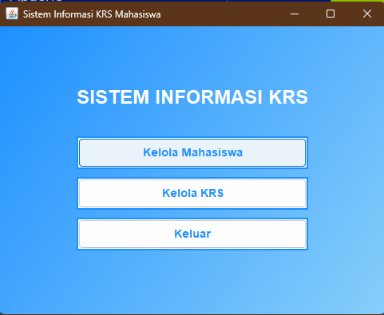
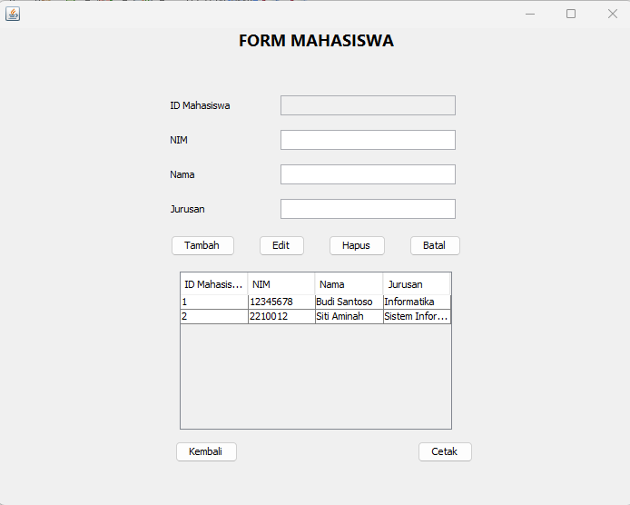
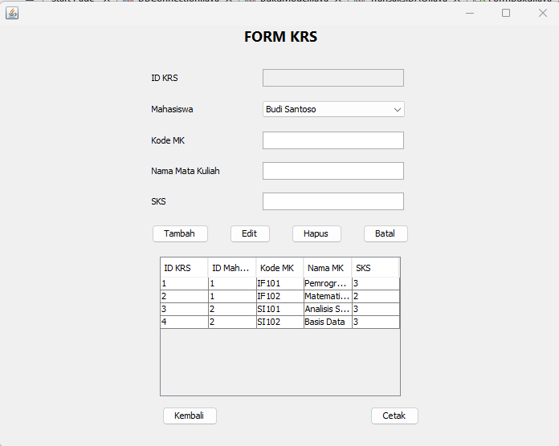
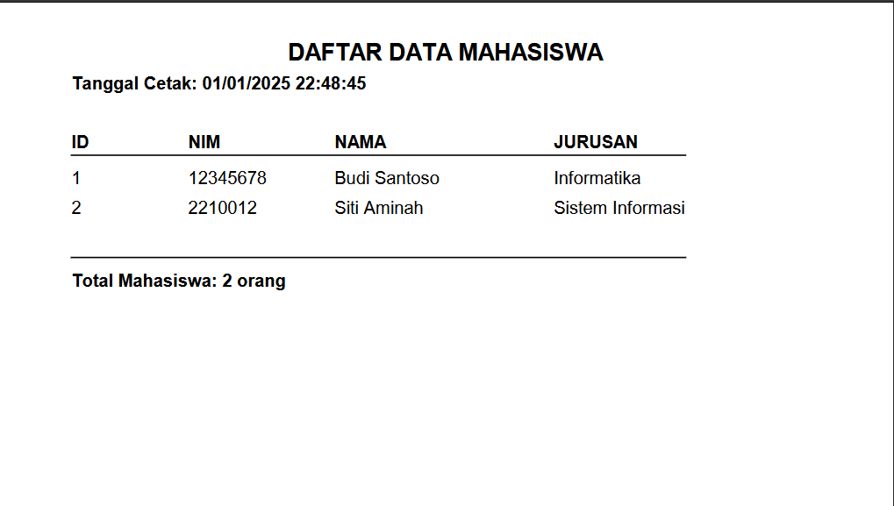
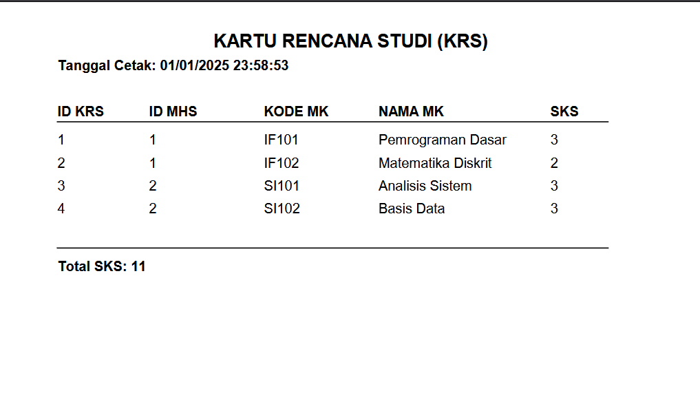

# Aplikasi Pengelolaan KRS

## Deskripsi
Aplikasi Pengelolaan KRS adalah sebuah aplikasi berbasis desktop yang digunakan untuk mengelola Kartu Rencana Studi (KRS) mahasiswa. Aplikasi ini mendukung fitur CRUD (Create, Read, Update, Delete) dan juga mencetak data KRS.

## Fitur Utama
- **Manajemen Mahasiswa**: Menambah, mengedit, menghapus, dan melihat data mahasiswa.
- **Pengelolaan KRS**: Menambah, mengedit, menghapus, dan melihat data KRS.
- **Cetak Data KRS**: Mencetak laporan data KRS dalam format tertentu.

## Struktur Form
1. **Form Mahasiswa**: 
   - Digunakan untuk mengelola data mahasiswa, seperti nama, NIM, dan informasi terkait lainnya.
2. **Form Kelola KRS**: 
   - Digunakan untuk mengatur KRS mahasiswa, seperti mata kuliah yang dipilih.

## Teknologi yang Digunakan
- Bahasa Pemrograman: Java
- IDE: NetBeans

## Tampilan Aplikasi

### Menu


### Form Mahasiswa


### Form Kelola KRS


### Cetak Mahasiswa


### Cetak KRS


## Cara Menjalankan Aplikasi
1. Clone repository ini:
   ```bash
   git clone https://github.com/ayukhofifah07/AyuKhofifah-2210010553-AplikasiPengelolaanKRS.git
   ```
2. Buka proyek ini menggunakan NetBeans.
3. Pastikan database telah disiapkan sesuai dengan file konfigurasi.
4. Jalankan aplikasi dari IDE.

## Pengembang
- Nama: Ayu Atut Khofifah
- NPM: 2210010553

## Lisensi
Aplikasi ini dikembangkan untuk keperluan pembelajaran dan bersifat open-source.

